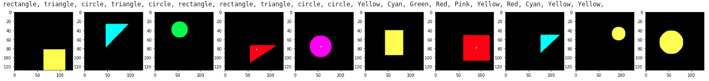
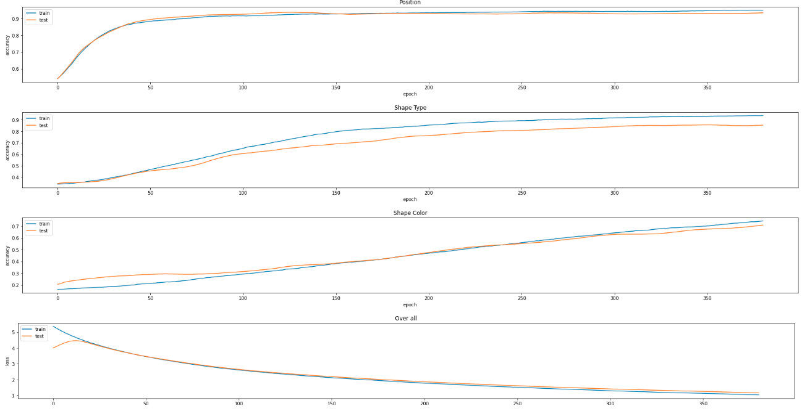

# Multi headed DNN predictor, detects object coordinates, color and shape type

Toy DNN to demonstrate the usage of the multi-headed output in Keras.
The task is to learn to detect basic shapes (circle, triangle, rectangle...and color) and the position of the shape center point.
The target was to create a slim network with an optimal number of trainable variables ( this has ~290 k).

Steps:
1. Create a toy database, generate shapes, color it. Prepare the data to be fed to DNN normalize values (values- mean)/ standard deviation and rescale the coordinate values from [0..128,0..128] -> [0..1,0..1].

 
  </a>

2. Create the multiheaded Keras functional model

 
  </a>

3. Train and test the DNN. After ~400 steps the network reaches about 93% accuracy on position prediction, 85% for shape, and 88% on colors.

 
  </a>

## Links

1. [keras](https://keras.io/)

/Enjoy.
